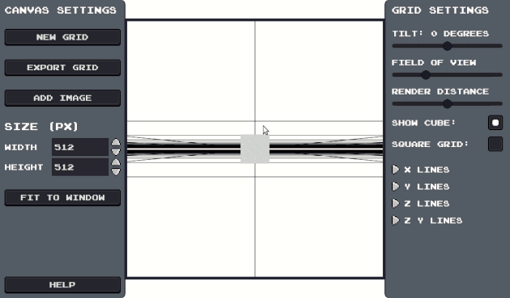
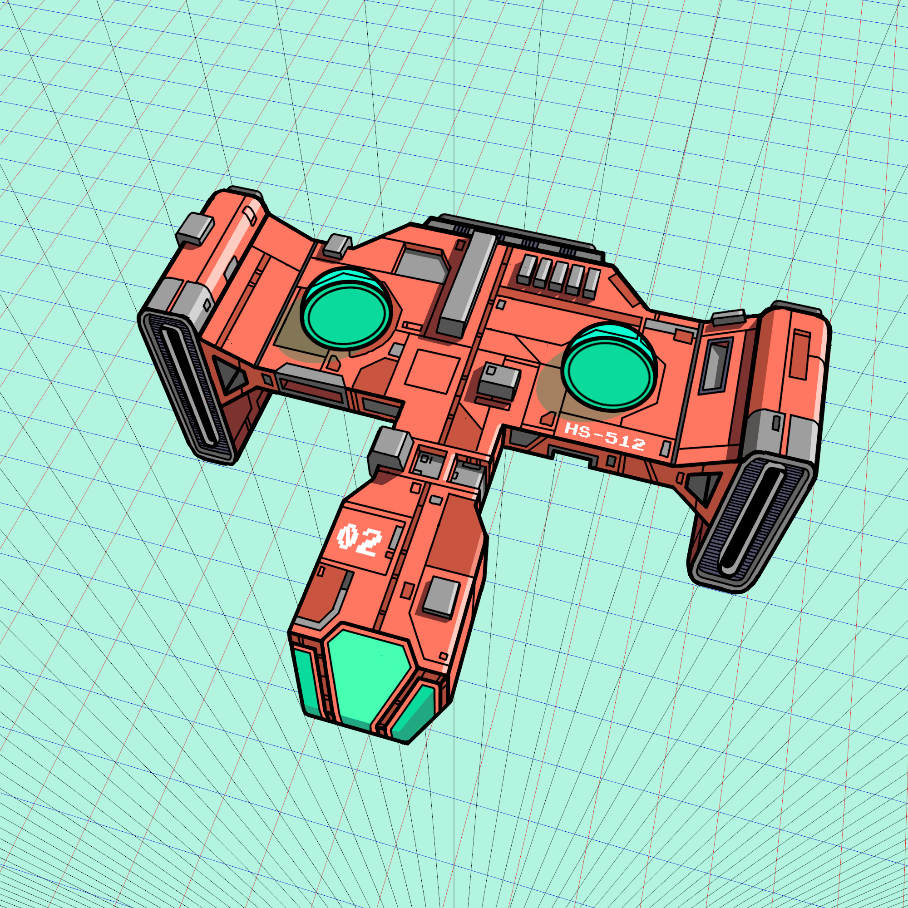

# perspective-grid-maker

Application for drawing perspective grids. Made with Godot.

Itch.io page: https://haztro.itch.io/perspective-grid-maker 

Blog post: https://haztro.dev/perspective-grid-maker

## Demo

Drawing using a grid generated with the application: 

